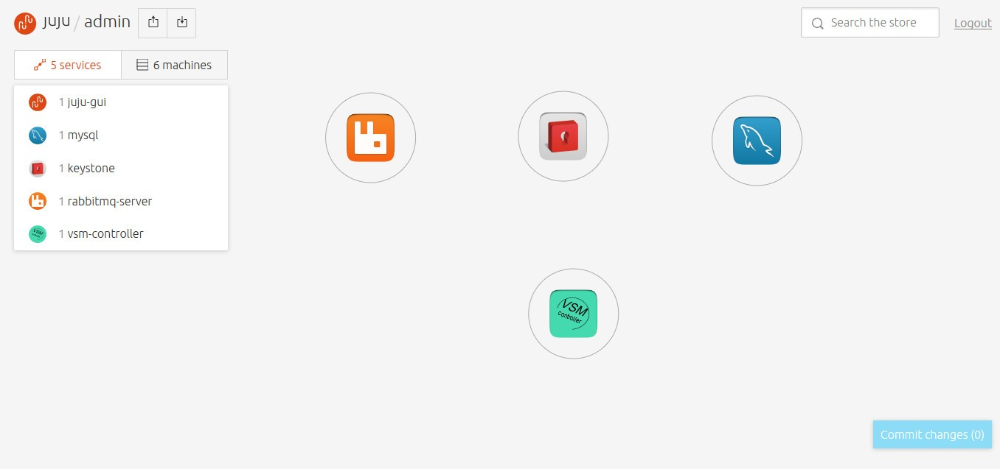
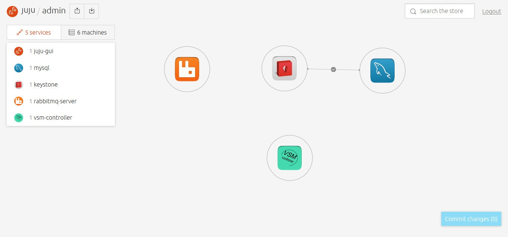
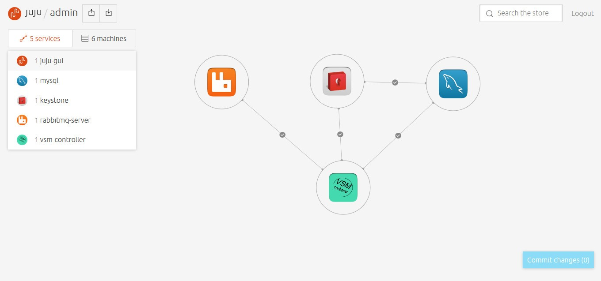

# charm-vsm-controller
Charm of juju for Virtual-Storage-Manager(VSM) Controller.
- VSM consists of vsm-controller and vsm-agent nodes.
- The charm aims to deploy the vsm-controller with vsm-api, vsm-scheduler and vsm-conductor.

### Prepare
* OS: ubuntu 14.04.3
* Juju: 1.25.5-trusty-amd64
* You should install the juju by youself at first [juju](https://jujucharms.com/).

### Steps by Steps
* login as root, then create an account for juju to use.
```sh
# useradd -m -s /bin/bash testuser
# passwd testuser
# su - testuser
```
* create directory for charm-vsm-controller and git clone from [charm-vsm-controller](https://github.com/flyingfish007/charm-vsm-controller)
```sh
$ mkdir -p charms/trusty
$ cd charms/trusty
$ git clone https://github.com/flyingfish007/charm-vsm-controller.git
$ mv charm-vsm-controller vsm-controller
```
* deploy keystone
```sh
$ juju deploy keystone
```
* deploy mysql
```sh
$ juju deploy mysql
```
* deploy rabbitmq-server
```sh
$ juju deploy rabbitmq-server
```
* deploy vsm-controller
```sh
$ juju deploy --repository=$HOME/charms local:trusty/vsm-controller
```
* you can use command 'juju debug-log' to see whether the deployment has been done. If all have been done, you must do as Notice.
* after you do as above, you can see that.  

* add the relation between keystone and mysql.(If you use proxy, please run command 'juju environment unset https-proxy;juju environment unset http-proxy;juju environment unset ftp-proxy')  

* add the relation between vsm-controller and mysql, vsm-controller and keystone and vsm-controller and rabbitmq-server.  

* get the password of vsm from the vsm-controller node.
* login: https://ip/dashboard

---
### Notice(Important)
* The charm-keystone is developed by openstack. So the valid service don't include the 'vsm'. So after you install the charm-keystone, you should change the code of it.
* You should run "juju ssh keystone/\*", then "sudo vim /var/lib/juju/agents/unit-keystone-\*/charm/hooks/keystone_utils.py".
* Of the keystone_utils.py, you should add as followed:
```py
valid_services = {
    "vsm": {
        "type": "vsm",
        "desc": "VSM Service"
    },
    ...
}
```
